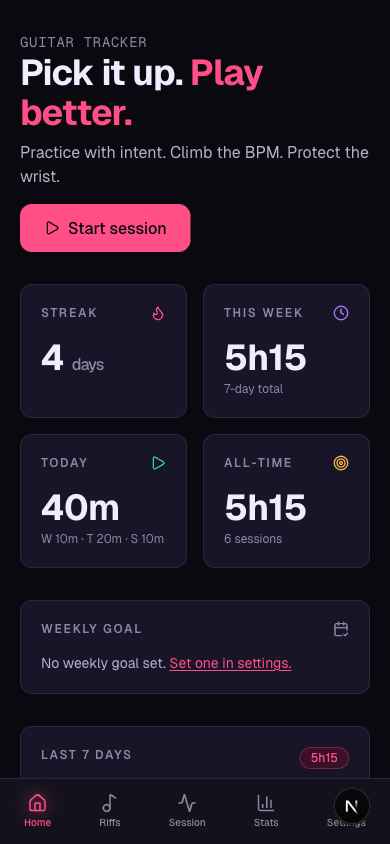
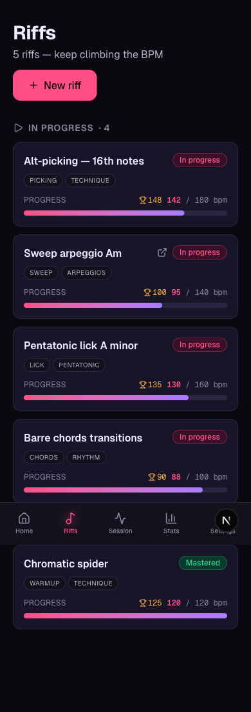
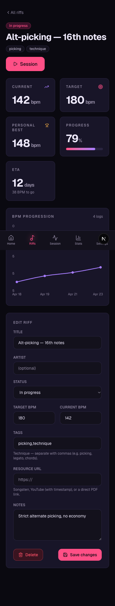
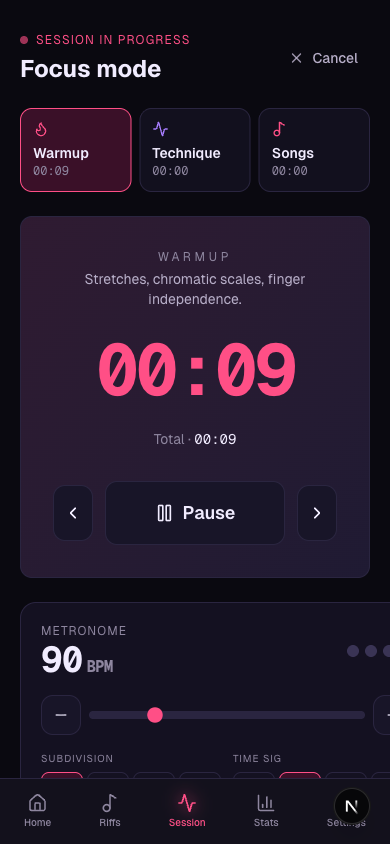
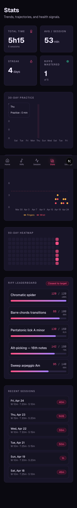
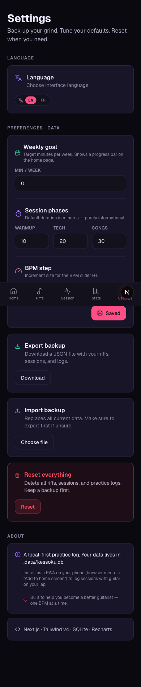

# Kessoku Tracker

**A local-first guitar practice tracker.** Log sessions, climb the BPM, protect the wrist.

Built for guitarists who practice with intent — not for a specific song, but to become a better player overall.

---

## Screenshots

<div align="center">

### Dashboard — streak, weekly goal, in-progress riffs


### Riffs — tags, personal best, BPM progress


### Riff detail — BPM progression chart, ETA


### Session — 3-phase timer, metronome, tap tempo


### Stats — 30-day bars, pain chart, leaderboard


### Settings — weekly goal, phases, BPM step, EN/FR


</div>

---

## Features

**Practice tracking**
- 3-phase session timer (Warmup / Technique / Songs) with configurable default durations
- Screen wake-lock during active sessions — screen stays on with guitar on your lap
- Keyboard shortcuts: `Space` pause, `←` / `→` switch phase

**BPM system**
- Log current BPM per riff during every session
- Personal record (max BPM) tracked automatically with 🏆 indicator
- BPM progression line chart with target reference line
- ETA calculator based on historical rate of improvement
- Configurable BPM step (±1, ±2, ±5, ±10)

**Metronome**
- Web Audio API — precise scheduling, no drift
- Tap tempo (tap 2+ times → average interval)
- Subdivisions: quarter / 8th / triplet / 16th
- Time signature: 3/4, 4/4, 5/4, 6/4
- Visual beat indicator with accent on beat 1
- Mute toggle

**Riff management**
- Tags per riff (picking, legato, chords, sweep…) — shown as filter pills
- Resource link per riff (Songsterr, YouTube timestamp, PDF) with direct "Let's play" button
- Status: To do / In progress / Mastered

**Dashboard intelligence**
- Weekly practice goal with progress bar
- "Time to revisit" — surfaces riffs not practiced in 4+ days
- 90-day GitHub-style practice heatmap
- Tendinitis alert: wrist pain ≥ 4/10 on 2 of last 3 sessions → red banner

**End-of-session**
- Pain diary: fingers + wrist (0–10) + mood + notes
- Session insights screen: BPM gains, new PRs, phase breakdown

**Stats**
- 30-day bar chart, pain trend chart, 90-day heatmap
- Riff leaderboard (closest to target)
- Recent sessions with phase breakdown

**i18n**
- English / Français — switcher in the nav sidebar + Settings page
- Cookie-persisted, switches without reload

**Data**
- Local-first: SQLite at `.data/kessoku.db` — no account, no cloud
- JSON export / import backup
- Full reset

**PWA**
- Installable via browser "Add to home screen" — works offline

---

## Tech stack

| Layer | Choice |
|-------|--------|
| Framework | Next.js 16 (App Router, Turbopack) |
| React | React 19 |
| Styling | Tailwind CSS v4 |
| Database | SQLite via `better-sqlite3` |
| Charts | Recharts |
| Icons | lucide-react |
| Audio | Web Audio API (no dependencies) |

---

## Getting started

```bash
npm install
npm run dev
```

Open [http://localhost:3000](http://localhost:3000). The DB is created automatically at `.data/kessoku.db` on first launch.

For the best experience open Chrome DevTools → device toolbar → iPhone 14 Pro, or install as a PWA.

```bash
npm run build   # production build
npm run lint    # ESLint
```

---

## Data location

All data is stored locally in `.data/kessoku.db` (SQLite, WAL mode). Back up via **Settings → Export backup** before reinstalling.

---

## License

MIT
